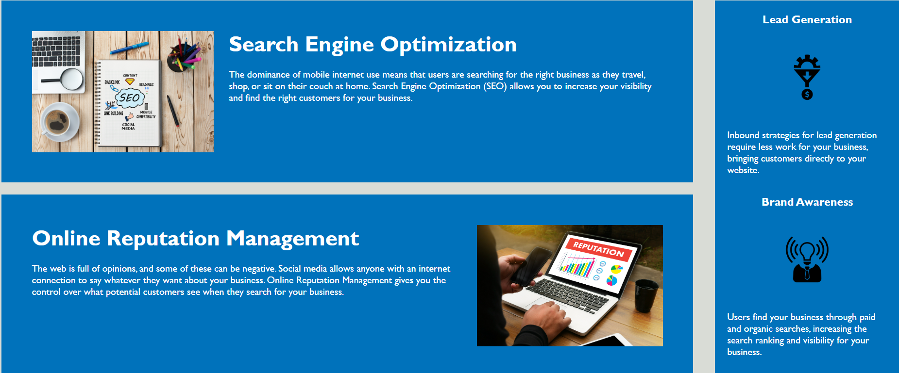

# HTML-CSS Accessibility Challenge

## Table of Contents
- [Description](#description)
- [What was learned?](#what-was-learned)
- [Website](#website)
- [Credits](#credits)

## Description
This project was built to practice Web Development accessibility standards. The objective of this was to go
through the HTML & CSS code and figure out how to make it more semantic as well as more accessible on the web.

This was done by refactoring the HTML code to remove non-semantic elements such as *div* and *span*. These were
replaced by semantic elements like *figure*, *section* and *article*. As well as removing unused classes/ids

The CSS file was also refactored by adding comments, re-ordering and organizing the elements, removing unneccesary classes.

## What was learned?
Throughout the course of this challenge, I had learned how to make websites more accessible to people with disabilities by
using alt tags and contrasting the elements. I also learned how to use semantic HTML on a webpage to help navigation
of screen reader softwares.

## Website
[The link to the deployed webpage can be found here](https://angadbatth.github.io/challenge-html-css/)

## Credits

[WAVE Evaluation Tool](https://chrome.google.com/webstore/detail/wave-evaluation-tool/jbbplnpkjmmeebjpijfedlgcdilocofh)
[W3 Schools Semantic Elements](https://www.w3schools.com/html/html5_semantic_elements.asp)
[W3 Schools HTML Accessibility](https://www.w3schools.com/html/html_accessibility.asp)
2019 Horiseon Social Solution Services, Inc.

